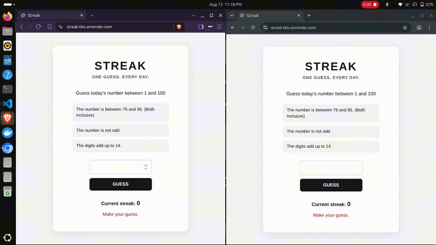

# Streak

A simple daily number-guessing game where every player gets the same puzzle each day and can make one guess per day.

## Demo

[](docs/demo.gif)

## Live Demo

[https://streak-tklv.onrender.com/](https://streak-tklv.onrender.com/)

## Features

- One daily puzzle shared by all players
- Three clues to help narrow down the number
- One guess per day
- Server-side answer validation
- Daily streak tracking
- Streak reset after a wrong guess or missed day
- UUID-based player identification
- Persistent player data
- Responsive single-page frontend

## Tech Stack

- Python
- FastAPI
- Vanilla HTML/CSS/JavaScript
- SQLite for local development
- PostgreSQL via Supabase for production
- Render for deployment

## Architecture

The browser is responsible only for the user interface.

```text
Browser
   ↓
JavaScript
   ↓
FastAPI
   ↓
Game Logic
   ↓
Database
   ↓
FastAPI
   ↓
JavaScript
   ↓
Screen
````

The daily answer is generated and checked entirely on the backend. The answer is never sent to the browser.

Local development uses SQLite:

```text
Local
   ↓
SQLite
   ↓
streak.db
```

Production uses PostgreSQL:

```text
Render
   ↓
DATABASE_URL
   ↓
Supabase PostgreSQL
```

## Local Setup

Clone the repository:

```bash
git clone https://github.com/Alokik24/streak
cd streak
```

Create a virtual environment:

```bash
python3 -m venv .venv
source .venv/bin/activate
```

Install dependencies:

```bash
pip install -r requirements.txt
```

For local development, leave `DATABASE_URL` unset so the application uses SQLite.

Start the application:

```bash
uvicorn app.main:app --reload
```

Open:

```text
http://localhost:8000
```

## API

### `GET /api/today`

Returns today's game state.

Example:

```json
{
  "min": 1,
  "max": 100,
  "clues": [
    "The number is between 56 and 75.",
    "The number is even.",
    "The number is divisible by 3."
  ],
  "streak": 3,
  "already_played": false,
  "message": "Make your guess."
}
```

The daily answer is never included in the response.

### `POST /api/guess`

Accepts a player's UUID and guess.

Example request:

```json
{
  "player_id": "player-uuid",
  "guess": 72
}
```

The server validates the guess against the server-side answer and updates the player's streak.

## Persistence

Players are identified using a UUID stored in browser `localStorage`.

Local development uses SQLite.

Production uses PostgreSQL through Supabase. The production database connection is supplied through the `DATABASE_URL` environment variable.

The database is not stored in the Git repository.